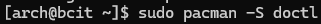
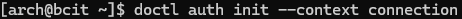

# How to Create a New DigitalOcean Droplet Running Arch Linux Using 'Doctl' and Command Line Tools

By Kurtis Li
A01382545

---
## Introduction

This guide takes you step-by-step how to create a new digital ocean droplet running Arch using doctl and command line. We will be generating ssh keys, setting up using cloud-init configurations, and using doctl to set up the droplet. 

All necessary files and instructions are included in the current GitHub repository, and it is assumed that you have already have a DigitalOcean account set up. 

---

## Generating SSH keys (CLI)

First, we need to generate an SSH key pair. This will allow us to securely connect to our droplet.

The ssh-keygen package should already be installed onto your system. SSH information is stored in a folder called .ssh in your home directory. For Windows users, this folder may not yet be created. If you do not see your .ssh folder in your home directory, create it before conducting the following steps.

1. Open a terminal window and run the following command to generate a new SSH key pair. Make sure to change the default fields to your user name, key name and email address to your preferences. Follow the prompts in the terminal window to generate your key:

```bash
ssh-keygen -t ed25519 -f C:\Users\<your-user-name>\.ssh\<key1> -C "youremail@email.com"
```

This command uses the ssh-keygen module, and it takes the type (-t), filename (-f), and comment (-C) fields. This command specifically uses the "ed25519" cryptography algorithm, points to the .ssh folder, and adds your email as a comment. 

Congratulations! You have successfully created an ssh key pair. These commands create two new files called 'key1' and 'key1.pub'. The contents of the 'key1' files contains the private and public keys, respectively. You will be using these keys later on in configuration to connect to your droplet.

---
## Downloading and Authenticating Doctl to set up Arch Linux Remote Server

Doctl is the official DigitalOcean command line interface (CLI). Doctl is the tool we will be using to interact with the DigitalOcean API and set up our remote server.

Assuming that we already have an existing droplet running Arch: 

1. Run the following command in the terminal window from the home directory:

```bash
sudo pacman -S doctl
```



This command uses "sudo" to allow the user to make changes to the system. "Pacman" is the command used to invoke the package manager, which we will be using to install the doctl package already included in the arch package repositories.

The following will show up on your terminal:


Follow the prompts to complete the installation of doctl. 

2. Go to your control panel on the DigitalOcean website. On the left menu bar, scroll down to the following section and click on **API**:

   

3. Click on **Generate New Token** once the following window appears:


4. Fill out the form according to your preferences. For this example, the token name will be set to newArchServer1, granting full access for the duration of 30 days. Click on **Generate Token**.
5. Copy the newly generated token from the textbox on the following screen. 

6. Go back to the terminal window. Run the following command to request authorization for doctl to be used with your DigitalOcean account:

Make sure to replace the authorization context name with the name of your choice. 
```bash
doctl auth init --context <NAME>
```

In this example, the authorization name is 'connection'.



7. Paste the authentication token you copied earlier beside *Enter your access token* and press **Enter**:


The terminal should show *Validating token...* Followed by a checkmark to indicate authorization success:


8. Run the following command to confirm authentication:

```bash
doctl account get
```

The terminal should show a table of the following information, including user email, team, droplet limit, email verification status and user UUID as follows: 


Congratulations, you have successfully installed and connected your account to doctl on your current arch server.

---
## Creating Arch Droplet from Current Droplet

A DigitalOcean droplet is a new instance of a sever hosted by DigitalOcean, the Software as a Service (SaaS) provider that we will be using. In the following steps, we will be creating and configuring a droplet in the San Francisco 3 region running Arch Linux.

### Uploading SSH Public Key to DigitalOcean Account

The first step to setting up a new DigitalOcean droplet is to upload our previously created public key to DigitalOcean. Now that we have doctl installed, we can use this package to upload our public key. In Terminal on your local , run the following command, ensuring to change the default fields to your own:

```bash
doctl compute ssh-key import <insert-key-name> --public-key-file /Users/<user-name>/.ssh/<your-key.pub>
```

The terminal output should appear as follows:


You have successfully uploaded your public key to DigitalOcean.
### Creating a Cloud-init File for Droplet Setup

When setting up a droplet, we can create a cloud-init file which will provide specific preferences, packages to install, user profiles, and other information we would want to include during setup to simplify and automate the process. Using a cloud-init file also helps to reproduce the same setup for other droplets by using the same cloud-init file.

To create the cloud-init file that we will be using to set up the new droplet:

1. Back in your terminal, open the contents of your public key file with the following command: 

```bash
cat /Users/<user-name>/.ssh/<public-key>.pub
```

2. Save the contents of the file listed below the command. We will be using this line later on when completing the cloud-init file.


3. Go back to your Arch Droplet in Terminal with the command:

```bash
ssh arch
```


4. Run the following command and follow the prompts provided to install the neovim package:
   
```bash
sudo pacman -S neovim
```

Neovim is a text editor that provides much greater functionality than simply using the terminal CLI. Not only will we be using Neovim to visualize/edit our cloud-init file, but it will be useful in many various different cases further along in linux classes and in professional settings.

With Neovim installed, we can now use it to edit our cloud-init file.

5.  Create a new file called cloud-init.yaml in your Arch home directory using the following command:

```bash
touch cloud-init.yaml
```

6. Run Neovim with the following command:

```bash
nvim cloud-init.yaml
```

The neovim text editor will open the cloud-init file. 

7. Paste the following into the file:

```yaml
#cloud-config
users:
  - name: kurti
    primary_group: admin 
    groups: admin, newgroup
    shell: /bin/bash
    sudo: ['ALL=(ALL) NOPASSWD:ALL']
    ssh-authorized-keys:
      - ssh-ed25519 AAAAC3NzaC1lZDI1NTE5AAAAIF7+r3Pwhz0wpNOd5W/xQh1ZqO/2jX3Zl5+NQ6qu18RZ kli180@my.bcit.ca
  - name: testUnit
    primary_group: newgroup
    groups: newgroup
    shell: /bin/bash
    sudo: ['ALL=(ALL) ALL']
    ssh-authorized-keys:
      - ssh-ed25519 AAAAC3NzaC1lZDI1NTE5AAAAIF7+r3Pwhz0wpNOd5W/xQh1ZqO/2jX3Zl5+NQ6qu18RZ kli180@my.bcit.ca
    passwd: 2420Assignment1
packages:
  - ripgrep
  - rsync
  - neovim
  - fd
  - less
  - man-db
  - bash-completion
  - tmux
  - git
  - gettext-base
  - awk
disable_root: true

```


https://docs.digitalocean.com/reference/doctl/

https://docs.digitalocean.com/reference/doctl/reference/compute/

https://docs.digitalocean.com/reference/doctl/reference/compute/image/create/

https://docs.digitalocean.com/reference/doctl/how-to/install/

https://wiki.archlinux.org/title/Cloud-init

https://docs.digitalocean.com/products/droplets/how-to/automate-setup-with-cloud-init/

https://www.digitalocean.com/community/questions/how-to-uplaod-file-from-computer-with-console

https://docs.digitalocean.com/products/custom-images/how-to/create-droplets/

https://neovim.io/doc/user/vimindex.html#index