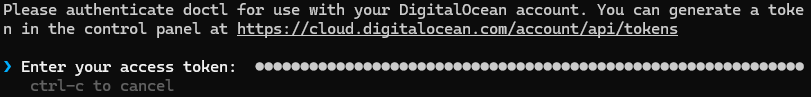

# How to Create a New DigitalOcean Droplet Running Arch Linux Using 'Doctl' and Command Line Tools

*By Kurtis Li - A01382545*

---
## Introduction

This guide takes you step-by-step how to create a new digital ocean droplet running Arch using doctl and command line. We will be generating ssh keys, setting up using cloud-init configurations, and using doctl to set up the droplet. 

All necessary files and instructions are included in the current GitHub repository aside from the Arch image, and it is assumed that you have already have a DigitalOcean account set up and will be using this tutorial from a host machine currently running Arch (as per assignment instructions). 

---

## Generating SSH keys (CLI)

First, we need to generate an SSH key pair, which is an encrypted key pair that we use as authentication to securely connect to our droplet.

The ssh-keygen package should already be installed onto your system. SSH information is stored in a folder called .ssh in your home directory. If you do not see your .ssh folder in your home directory, create it before conducting the following steps.

1. Open a terminal window and run the following command to generate a new SSH key pair. Make sure to change the default fields to your own key name and email address to your preferences. Follow the prompts in the terminal window to generate your key:

> ```bash
> ssh-keygen -t ed25519 -f ~/ssh/<key-name> -C "youremail@email.com"
> ```

This command uses the ssh-keygen module, and it takes the type (-t), filename (-f), and comment (-C) fields. This command specifically uses the "ed25519" cryptography algorithm, points to the .ssh folder where the key will be created, and adds your email as a comment. 

Congratulations! You have successfully created an ssh key pair. Two files will be created, one file with the name you selected and one with a file extension *.pub*. The contents of these files contains the private and public keys, respectively. You will be using these keys later on in configurating connection to your droplet.

---
## Downloading Doctl to set up Arch Linux Remote Server

Doctl is the official DigitalOcean command line interface (CLI). Doctl is the tool we will be using to interact with the DigitalOcean API and set up our remote server (doctl Command Line Interface, 2024).  To download Doctl:

1. Run the following command in the terminal window from your home directory:

> ```bash
> sudo pacman -S doctl
> ```

> [!NOTE]
> This command uses *sudo* to allow the user to make changes to the system. *Pacman* is the used to invoke the package manager, which we will be using to install the doctl package already included in the arch package repositories.

The following will show up on your terminal:


Follow the prompts to complete the installation of doctl. 

---

## Creating an Access Token to Connect Doctl to your DigitalOcean Account

The next step we must conduct is creating an access token, which is used to connect our DigitalOcean account to the doctl tool used in the terminal. To create our access token and connect doctl to our DigitalOcean account:

1. Go to your control panel on the DigitalOcean website. On the left navigation bar, scroll down to the following section and click on **API**:


2. Click on **Generate New Token** once the following window appears:


3. Fill out the form according to your preferences. For this example, the token name will be set to newArchServer1, granting full access for the duration of 30 days. Click on **Generate Token**.


4. Copy the newly generated token from the textbox on the following screen. 


5. Go back to the terminal window. Run the following command to request authorization for doctl to be used with your DigitalOcean account:

Make sure to replace the authorization context name with the name of your choice. 

> ```bash
> doctl auth init --context <NAME>
> ```

This command starts the doctl authentication tool with which you can use the token you just created to connect doctl to your account with DigitalOcean

6. Paste the authentication token you copied earlier beside *Enter your access token* and press **Enter**:



The terminal should show *Validating token...* Followed by a checkmark to indicate authorization success:


7. Run the following command to confirm authentication:

> ```bash
> doctl account get
> ```

The terminal should show a table of the following information, including user email, team, droplet limit, email verification status and user UUID as follows: 


Congratulations, you have successfully installed and connected your account to doctl on your current arch server.

---
## Uploading Arch Image to DigitalOcean

Before we can start creating a droplet with doctl, we must first install the Arch linux image, which contains all the files and data needed to run Arch on the system we are setting up. This includes the kernel, system files and directories. 

You can find the Arch Linux image from this link: 

https://gitlab.archlinux.org/archlinux/arch-boxes/-/package_files/7529/download

Once you have downloaded the Arch image, head back to the DigitalOcean Control Panel for the following steps: 

1. Click the **Manage** dropdown menu in left navigation bar
2. Click **Backups & Snapshots**
3. Click **Custom Images** tab at the top of the screen
4. Click the **Upload Image** button.
5. Upload the Arch Linux image that you downloaded

After clicking upload, a new settings box will open and you will need to select the following settings:

6. Select **Arch Linux** in the dropdown menu
7. Select **San Francisco 3** for the datacentre
8. Click **Upload Image** to finish

You have successfully uploaded the Arch image to digitalOcean.

---
## Creating Arch Droplet from Host Machine

A DigitalOcean droplet is a new instance of a sever hosted by DigitalOcean, the Software as a Service (SaaS) provider that we're using. In the following steps, we will be creating and configuring a droplet in the San Francisco 3 datacentre running Arch Linux. 

> [!NOTE]
> We are using the San Francisco 3 datacentre because it is the closest in proximity to our location, meaning we have the best chance for a strong connection.

### Uploading SSH Public Key to DigitalOcean Account

The first step to setting up a new DigitalOcean droplet is to upload our previously created public key to DigitalOcean. We can use the doctl tool to perform this task. In Terminal on your local machine, run the following command ensuring to change the default fields to your own:

> ```bash
> doctl compute ssh-key import <insert-key-name> --public-key-file ~/.ssh/ <your-key.pub>
> ```

This command uses the doctl tool to import the ssh key from the ssh key pair we created in earlier steps to DigitalOcean.

The terminal output should appear as follows:


You have successfully uploaded your public key to DigitalOcean.

--- 
### Creating a Cloud-init File for Droplet Setup

When setting up a droplet, we can create a cloud-init file which will provide specific preferences, packages to install, user profiles, and other information we would want to include during setup to simplify and automate the process. Using a cloud-init file also helps to reproduce the same setup for other droplets by using the same cloud-init file.

To create the cloud-init file that we will be using to set up the new droplet:

1. Back in your terminal, open the contents of your public key file with the following command (change the default value with your key name): 

> ```bash
> cat ~/.ssh/<public-key>.pub
> ```

> [!NOTE]
> The cat command (meaning concatenate) prints out the contents of any file whose path we input as the argument for the command.*

2. Save the contents of the file listed below the command. We will be using this line later on when completing the cloud-init file.

3. Run the following command and follow the prompts provided to install the neovim package:
   
> ```bash
> sudo pacman -S neovim
> ```

Neovim is a text editor that provides much greater functionality than simply using the terminal CLI. Not only will we be using Neovim to visualize/edit our cloud-init file, but it will be useful in many various different cases further along in our  and in professional settings.

With Neovim installed, we can now use it to edit our cloud-init file.

5. Run Neovim with the following command:

> ```bash
> nvim cloud-init.yaml
> ```

The neovim text editor will create and open the cloud-init file in neovim. 

6. Press the I key to enable editing on neovim. At the bottom of the Terminal, you should see the word Insert.

7. Paste the following into the file and make changes to the default values:

> ```yaml
> #cloud-config
> users:
>   - name: <your-user-name>
>     primary_group: <insert-group> 
>     groups: <insert-group>
>     shell: /bin/bash
>     sudo: ['ALL=(ALL) NOPASSWD:ALL']
>     ssh-authorized-keys:
>       - <your-public-key-here>
> packages:
>   - ripgrep
>   - rsync
>   - neovim
>   - fd
>   - less
>   - man-db
>   - bash-completion
>   - tmux
>   - git
>   - gettext-base
>   - awk
> disable_root: true
> 
> ```

> [!IMPORTANT]
> The default value *your-public-key-here* is replaced by the text we copied from the public key file.

8. Press escape and then type **:wq** to save and quit the file.

Your Cloud-init file has been successfully created.

---
### Deploying the Arch Droplet

You have now completed all the steps you need in preparation for deploying the DigitalOcean droplet. Now that we have everything we need, to deploy the droplet:

1. Run the following command into the Terminal:

> ```bash
> doctl compute ssh-key list
> ```

This command will return the list of SSH keys we have connected to DigitalOcean. We will be using the SSH Fingerprint connected to the SSH you created, so copy down the contents under the Fingerprint columb of the SSH key you will be using.

2. Get the list of images within DigitalOcean's library using the following command:

> ```bash
> doctl compute image list
> ```

This command returns the list of images available to be used to deploy droplets. Search for the Arch linux image that we uploaded to DigitalOcean; under **Type**, the custom image should say *custom*, and under **Distribution**, the image should say *Arch Linux*. Copy down the ID of the image.

3. Run the following command to deploy your droplet:

> ```bash 
> doctl compute droplet create --image <image-ID> --size s-1vcpu-1gb-amd --region sfo3 --ssh-keys <ssh-key-fingerprint> --user-data-file <path-to-your-cloud-init-file> --wait <name of your droplet>
> ```

This command is one of the longest commands we will run during setup. The command operates as follows:

- **--image** - the ID of the arch image that we uploaded to DigitalOcean
- **--size** - the specifications of the server we are creating (in this example, we are creating a system running AMD with 1 vcpu and 1gb RAM)
- **--region** - the datacentre that we are creating the droplet on - San Francisco 3
- **--ssh-keys** - the fingerprint of the SSH key we created
- **--user-data-file** the path to the cloud-init file we created
- **--wait** - where you put your chosen name for the droplet

The following information should appear on your Terminal indicating a successful droplet deployment:


In this example, the name of the droplet is lvl3drop.

Congratulations! You have successfully deployed the arch droplet on DigitalOcean.

---
### Connecting to your DigitalOcean Droplet

Now that we have deployed our droplet, we should be able to connect to the server after completing the following steps:

1. Copy down the Public IPv4 address that is shown under your droplet. It should be the third item from the left displayed in the droplet information.


1. From the home directory of your host machine, navigate to your .ssh folder:

> ```bash
> cd .ssh	
> ```

3. Create a new file with neovim in the .ssh folder named *config*:

> ```bash
> nvim config
> ```

4. Paste the following information into the config file (press I on your keyboard to edit). Ensure to change the default fields to a name of your preference, the droplet IP you copied, and the name of the key we created earlier:

> ```
> Host <enter-name>
>   HostName <droplet-IP>
>   User arch
>   PreferredAuthentications publickey
>   IdentityFile ~/.ssh/<key-name>
>   StrictHostKeyChecking no
>   UserKnownHostsFile /dev/null
> ```

5. Save and quit neovim (:wq).

6. Run the following command into the terminal to access your droplet (ensure to change default field):

> ```bash
> ssh <name-you-entered-in-config-file>
> ```

Congratulations! You have completed all the steps required to create and access a brand new DigitalOcean droplet using the 'doctl' and command line tools. 

---
## References

DigitalOcean. (June 2024). _doctl Command Line Interface_. [https://docs.digitalocean.com/reference/doctl/](https://docs.digitalocean.com/reference/doctl/)
    
DigitalOcean. (July 2024). _doctl compute. [https://docs.digitalocean.com/reference/doctl/reference/compute/](https://docs.digitalocean.com/reference/doctl/reference/compute/)
    
DigitalOcean. (July 2024). _doctl compute image create_. [https://docs.digitalocean.com/reference/doctl/reference/compute/image/create/](https://docs.digitalocean.com/reference/doctl/reference/compute/image/create/)
    
DigitalOcean. (August 2024). _Install doctl_. [https://docs.digitalocean.com/reference/doctl/how-to/install/](https://docs.digitalocean.com/reference/doctl/how-to/install/)
    
Arch Linux. (July 2024). _Cloud-init_. [https://wiki.archlinux.org/title/Cloud-init](https://wiki.archlinux.org/title/Cloud-init)
    
DigitalOcean. (August 2024). _Automate Droplet Setup with Cloud-Init_. [https://docs.digitalocean.com/products/droplets/how-to/automate-setup-with-cloud-init/](https://docs.digitalocean.com/products/droplets/how-to/automate-setup-with-cloud-init/)
    
DigitalOcean. (July 2024). _Create Droplets from Custom Images_. [https://docs.digitalocean.com/products/custom-images/how-to/create-droplets/](https://docs.digitalocean.com/products/custom-images/how-to/create-droplets/)
    
Neovim. (September 2024). _Vim Index_. [https://neovim.io/doc/user/vimindex.html#index](https://neovim.io/doc/user/vimindex.html#index)